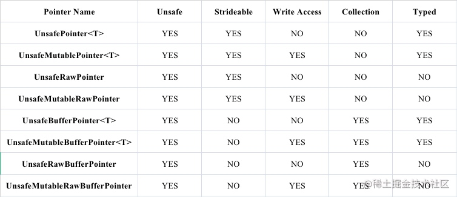

#  CVPixelBufferCreateWithBytes
```swift
func CVPixelBufferCreateWithBytes(
    _ allocator: CFAllocator?,
    _ width: Int,
    _ height: Int,
    _ pixelFormatType: OSType,
    _ baseAddress: UnsafeMutableRawPointer,
    _ bytesPerRow: Int,
    _ releaseCallback: CVPixelBufferReleaseBytesCallback?,
    _ releaseRefCon: UnsafeMutableRawPointer?,
    _ pixelBufferAttributes: CFDictionary?,
    _ pixelBufferOut: UnsafeMutablePointer<CVPixelBuffer?>
) -> CVReturn

```
Parameters
allocator
The allocator to use to create this buffer. Pass NULL to specify the default allocator.

width
The width of the pixel buffer, in pixels.缓冲区宽度 单位像素

height
The height of the pixel buffer, in pixels.缓冲区高度 单位像素

pixelFormatType
The pixel format identified by its respective four character code (type OSType).

baseAddress
A pointer to the base address of the memory storing the pixels.指针指向存储像素内存的基地址

bytesPerRow
The row bytes of the pixel storage memory.

releaseCallback
The callback function to be called when the pixel buffer is destroyed. This callback allows the owner of the pixels to free the memory. See CVPixelBufferReleaseBytesCallback for more information.

releaseRefCon
The user data identifying the pixel buffer. This value is passed to your pixel buffer release callback.

pixelBufferAttributes
A Core Foundation dictionary with additional attributes for a pixel buffer. This parameter is optional. See Pixel Buffer Attribute Keys for more details.

pixelBufferOut
On output, the newly created pixel buffer. Ownership follows the The Create Rule.


