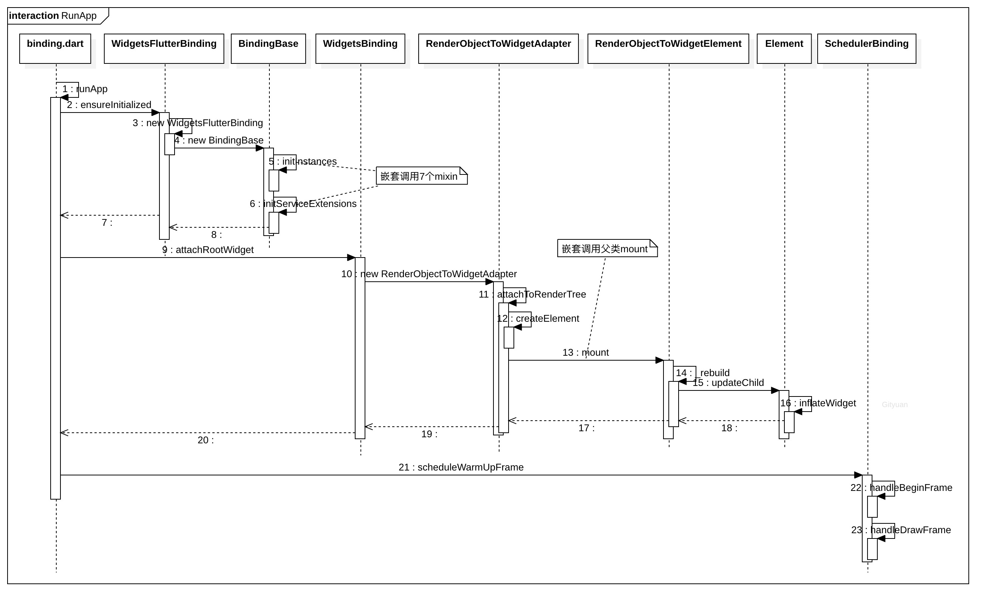

# Flutter启动流程


http://gityuan.com/2019/06/29/flutter_run_app/

## runApp(Widget app)
```swift
void main() {
  runApp(const MyApp());
}
```
```swift
void runApp(Widget app) {
  WidgetsFlutterBinding.ensureInitialized() //step 1
    ..scheduleAttachRootWidget(app) //step 2
    ..scheduleWarmUpFrame(); //step 3
}
```
### step 1 WidgetsFlutterBinding.ensureInitialized()
```swift
class WidgetsFlutterBinding extends BindingBase with GestureBinding, SchedulerBinding, ServicesBinding, PaintingBinding, SemanticsBinding, RendererBinding, WidgetsBinding {
    static WidgetsBinding ensureInitialized() {
        if (WidgetsBinding.instance == null)
          WidgetsFlutterBinding();
        return WidgetsBinding.instance!;
    }
}
```
- - -
#### step 1-1 WidgetsFlutterBinding解析
WidgetsFlutterBinding继承BindingBase，且混入了如下mixin（顺序严格如下）:
```
GestureBinding, 
SchedulerBinding,
ServicesBinding,
PaintingBinding, 
SemanticsBinding,
RendererBinding,
WidgetsBinding
```
以上所有的mixin都约束了该mixin的条件为必须继承自BindingBase，这也是为什么WidgetsFlutterBinding类继承自BindingBase的原因。

#### step 1-2 BindingBase解析
```js
abstract class BindingBase {
    BindingBase() {
        //省略无关代码
        initInstances();
            
        initServiceExtensions();
    }
    // 这里会生成一个单例window对象 由于各个mixin都约束了被混入类要继承自BindingBase 所以可以在各个binding中访问到当前的单例window
    ui.SingletonFlutterWindow get window => ui.window;
}
```
window构造需要两个参数 一个是windowId 一个是PlatformDispatcher(*这个玩意后续有时间再看，PS（Copy的其他文章中的）：这个类负责派发从平台过来的各种从平台配置到屏幕和窗口的创建或销毁的事件，里面定义了许多的native方法，负责flutter与平台底层的交互。 PlatformDispatcher向上层暴露了核心调度程序API、输入事件回调、图形绘制API和其他此类核心服务。*)
window的继承关系 SingletonFlutterWindow -> FlutterWindow -> FlutterView
所以下面的是一个示意类 $\color{red}{各个属性或者回调会根据功能的不同分散在继承关系链的各个层级中，window会有多种事件的回调会被在各个mixin的构造过程中根据功能的不同被各个mixin实现相应事件的回调}$
```swift
    class SingletonFlutterWindow {
    // 当绘制区域大小改变回调
    VoidCallback get onMetricsChanged => _onMetricsChanged;  
    
    // 当前设备的DPI，即一个逻辑像素显示多少物理像素，数字越大，显示效果就越精细保真。iOS中的 @2x @3x等 
    double get devicePixelRatio => _devicePixelRatio;
      
    // Flutter UI绘制区域的大小
    Size get physicalSize => _physicalSize;
    
    // 当前系统默认的语言Locale
    Locale get locale;
        
    // 当前系统字体缩放比例。  
    double get textScaleFactor => _textScaleFactor;  
        
    // Locale发生变化回调
    VoidCallback get onLocaleChanged => _onLocaleChanged;
    
    // 系统字体缩放变化回调
    VoidCallback get onTextScaleFactorChanged => _onTextScaleFactorChanged;
    
    // 绘制前回调，一般会受显示器的垂直同步信号VSync驱动，当屏幕刷新时就会被调用
    FrameCallback get onBeginFrame => _onBeginFrame;
    
    // 绘制回调  
    VoidCallback get onDrawFrame => _onDrawFrame;
    
    // 点击或指针事件回调
    PointerDataPacketCallback get onPointerDataPacket => _onPointerDataPacket;
    
    // 调度Frame，该方法执行后，onBeginFrame和onDrawFrame将紧接着会在合适时机被调用，
    // 此方法会直接调用Flutter engine的Window_scheduleFrame方法
    void scheduleFrame() native 'Window_scheduleFrame';
    
    // 更新应用在GPU上的渲染,此方法会直接调用Flutter engine的Window_render方法
    void render(Scene scene) native 'Window_render';
    
    // 发送平台消息
    void sendPlatformMessage(String name,
                           ByteData data,
                           PlatformMessageResponseCallback callback) ;
    // 平台通道消息处理回调  
    PlatformMessageCallback get onPlatformMessage => _onPlatformMessage;
      
}
```
WidgetsFlutterBinding在调用构造方法时，首先会调用抽象父类的构造方法，而父类的构造方法中(如上图)默认调用了
initInstances()方法，而WidgetsFlutterBinding混入了上述多个mixin，所有的mixin中全部重写了initInstances()因此最后被混入的mixin的方法会覆盖之前的方法调用，所以step 1中的最终调用可以概述为:
```
1.WidgetsFlutterBinding 调用构造方法
2.抽象父类BindBase调用构造方法
3.BindBase构造方法调用initInstances()方法，会默认调用子类WidgetsFlutterBinding的实现
4.由于WidgetsFlutterBinding混入了多个mixin中都重写了initInstances()方法
4.根据mixin规则会调用最后一个mixin的重写的initInstances()方法
5.根据4调用WidgetsBinding的initInstances()方法
```
#### step 1-3 WidgetsBinding解析
```swift
//省略无关代码
mixin WidgetsBinding on BindingBase, ServicesBinding, SchedulerBinding, GestureBinding, RendererBinding, SemanticsBinding {
  @override
  void initInstances() {
    super.initInstances();//这里会沿着mixin的顺序向上调用各个mixin的initInstances()
    _instance = this;
    
   // Initialization of [_buildOwner] has to be done after
    // [super.initInstances] is called, as it requires [ServicesBinding] to
    // properly setup the [defaultBinaryMessenger] instance.
    // 这里的buildOwner初始化要在super.initInstance之后 BuildOwner需要ServicesBinding的初始化来保证
    //defaultBinaryMessenger实例初始化完成
    _buildOwner = BuildOwner();
    buildOwner!.onBuildScheduled = _handleBuildScheduled;
    
    /*
    window单例是在BindingBase类构造的 各个binding都可以引用到
    ui.SingletonFlutterWindow get window => ui.window;
    */
    $\color{red}{实现了window的事件回调}$
    window.onLocaleChanged = handleLocaleChanged;
    window.onAccessibilityFeaturesChanged = handleAccessibilityFeaturesChanged;
    
    SystemChannels.navigation.setMethodCallHandler(_handleNavigationInvocation);
  }
  
   /// The current [WidgetsBinding], if one has been created.
  ///
  /// If you need the binding to be constructed before calling [runApp],
  /// you can ensure a Widget binding has been constructed by calling the
  /// `WidgetsFlutterBinding.ensureInitialized()` function.
  static WidgetsBinding? get instance => _instance;
  static WidgetsBinding? _instance;
}
```
可以看到WidgetsBinding在调用自身initInstances()调用了 super.initInstances();因此会沿着下图中<u>自上向下</u>顺序依次调用各个mixin重写的initInstances()的方法，完成各个binding的初始化
PS：这个构造顺序和OC类似 和swift反过来，即先保证父类初始化完毕后再进行自身初始化
```
GestureBinding:
mixin GestureBinding on BindingBase implements HitTestable, HitTestDispatcher, HitTestTarget {
//省略实现 下面会有主要代码分析
}

SchedulerBinding:
mixin SchedulerBinding on BindingBase{
//省略实现
}

ServicesBinding:
mixin ServicesBinding on BindingBase, SchedulerBinding {
//省略实现
}

PaintingBinding:
mixin PaintingBinding on BindingBase, ServicesBinding {
//省略实现
}

SemanticsBinding:
mixin SemanticsBinding on BindingBase {
//省略实现
}

RendererBinding:
mixin RendererBinding on BindingBase, ServicesBinding, SchedulerBinding, GestureBinding, SemanticsBinding, HitTestable {
//省略实现
}

WidgetsBinding:
mixin WidgetsBinding on BindingBase, ServicesBinding, SchedulerBinding, GestureBinding, RendererBinding, SemanticsBinding {
//省略实现
}
```
所以 initInstances 的执行顺序依次是：***BindingBase -> GestureBinding -> SchedulerBinding -> ServicesBinding -> PaintingBinding -> SemanticsBinding -> RendererBinding -> WidgetsBinding***，从而依次完成各个 Binding 的初始化相关工作。而各个binding在初始化的过程中会构造对应功能类，具体见各个binding的实现部分。
这里有个demo可以模拟调用过程
```swift
import 'dart:core';

abstract class BindingBase {
  BindingBase() { //Step - 2 打印log并调用initInstances()方法
    print('抽象父类初始化 准备调用自身initInstances');
    initInstances();
  }
  /*
  Step - 3 这里会按照mixin的顺序去调用对应的实现 由于MixIn_C最后被混入所以该方法会被MixIn_C中的
  实现覆盖，所以会去调用 MixIn_C的方法 所以log目前不会被打印
  */
  initInstances() { 
  // Step - 8 由MixIn_A中的 super.initInstances()最终会调用到该实现，所以log开始打印，打印后该方法会出栈，然后调用栈顶的下一个函数也就是MixIn_A中的log
    print('抽象父类 initInstances 方法调用');
  }
}

mixin MixIn_A on BindingBase {
  // @override
  initInstances() {
  // Step - 7 会调用BindingBase中的initInstances()方法 所以log在这个节点也不会打印
    super.initInstances();   
    // Step - 9 BindingBase中的initInstances()执行完毕打印log后出栈，调用当前mixin中的log
    print('mixin A initInstances 方法调用');
  }
}

mixin MixIn_B on BindingBase {
  @override
  initInstances() {
  // Step - 6 根据混入顺序 会调用MixIn_A中的initInstances()方法 所以log在这个节点也不会打印
   super.initInstances();
   // Step - 10 MixIn_A中的initInstances()执行完毕打印log后出栈，调用当前mixin中的log
   print('mixin B initInstances 方法调用');
  }
}

mixin MixIn_C on BindingBase {
  /*
  Step - 4 Bindbase中的调用会走到这一步
  */
  @override
  initInstances() {
    // Step - 5 根据混入顺序 super.initInstances()调用会调用MixIn_B中的initInstances()方法 所以log在这个节点也不会打印
    super.initInstances();   
    // Step - 11 MixIn_A中的initInstances()执行完毕打印log后出栈，调用当前mixin中的log
    print('mixin C initInstances 方法调用');
  }
}

class WidgetsFlutterBinding extends BindingBase with MixIn_A, MixIn_B, MixIn_C {
  WidgetsFlutterBinding() : super() { //Step - 1 这里的super()会调用BindingBase的初始化方法 
    // Step - 12 父类和mixin中所有方法执行完毕 打印如下log
    print('子类初始化');
  }
}

main() {
  print('begin');
  var p = WidgetsFlutterBinding(); //Step - 0
  print('end');
}
```
>  log如下
**begin
抽象父类初始化 准备调用自身initInstances
抽象父类 initInstances 方法调用
mixin A initInstances 方法调用
mixin B initInstances 方法调用
mixin C initInstances 方法调用
子类初始化
end**

自此 step 1 执行完毕且返回了WidgetsBinding的实例

#### Step 1-4 GestureBinding解析
```swift
mixin GestureBinding on BindingBase implements HitTestable, HitTestDispatcher, HitTestTarget {
  @override
  void initInstances() {
    super.initInstances();
    _instance = this;
    /// window还是在BindingBase中的单例window对象，是定义在dart:ui中的window类的一个单例。这里赋值一个回调函数用于接收window透传的屏幕事件
    /// 具体看下面的函数实现
    window.onPointerDataPacket = _handlePointerDataPacket;
  }

  @override
  void unlocked() {
    super.unlocked();
    _flushPointerEventQueue();
  }

  /// The singleton instance of this object.
  /// 这里跟其他binding一样构造完成后通过 XxxBinding.instance!来访问
  static GestureBinding? get instance => _instance;
  static GestureBinding? _instance;
   
    /*
    Queue是一个先进先出的集合对象 可以理解为一个控制了进出顺序的数组，用于存储用户事件
    */
  final Queue<PointerEvent> _pendingPointerEvents = Queue<PointerEvent>();

    /*
    这个方法就是接收在BindingBase中的window对象分发的触摸事件
    ui.PointerDataPacket 是对触摸事件的一个数据封装
    class PointerDataPacket {
      /// Creates a packet of pointer data reports.
      const PointerDataPacket({ this.data = const <PointerData>[] }) : assert(data != null);
      /// This list might contain multiple pieces of data about the same pointer.
      final List<PointerData> data;
    }
    */
  void _handlePointerDataPacket(ui.PointerDataPacket packet) {
    // We convert pointer data to logical pixels so that e.g. the touch slop can be
    // defined in a device-independent manner.
    /*
    将packet数据用PointerEventConverter一通骚操作（大概是使用了生成器）之后加入到_pendingPointerEvents的Queue中
    */
    _pendingPointerEvents.addAll(PointerEventConverter.expand(packet.data, window.devicePixelRatio));
    if (!locked)
      _flushPointerEventQueue();
      
    /// 分发触摸事件  
    void _flushPointerEventQueue() {
        assert(!locked);
        /// 按照事件加入的顺序遍历分发事件
        while (_pendingPointerEvents.isNotEmpty)
          handlePointerEvent(_pendingPointerEvents.removeFirst());
    }
    /*
    经过一通看不懂的安全检查 会去调用 
    void _handlePointerEventImmediately(PointerEvent event) 
    再经过各种骚操作生成HitTestResult 去调用
    void dispatchEvent(PointerEvent event, HitTestResult? hitTestResult) 
    在经过骚的不行的操作之后最终调用
     void handleEvent(PointerEvent event, HitTestEntry entry) 
     具体实现都在GestureBind类中，看不懂有兴趣的可以去刨一刨
    */
  }
}
```
#### Step 1-5 SchedulerBinding解析
```swift
    mixin SchedulerBinding on BindingBase {
    @override
    void initInstances() {
        super.initInstances();
        _instance = this;
            
        if (!kReleaseMode) {
         // 将回调添加至一个私有的数组里面，调用见下面
          addTimingsCallback((List<FrameTiming> timings) {
            //addTimingsCallback调用时会给window设置onReportTimings回调，所以当window生成事件时
            //会调用这里并传递过来FrameTiming的数组,然后再循环调用_profileFramePostEvent方法
            // 最终会把FrameTiming封装成一个<String,<String,dynmic>>的map然后调用一下方法 key是一个
            // 硬编码的'Flutter.Frame'， value是把FrameTiming的各个属性值重装的一个map然后调用下述方法
            // developer.postEvent(eventKind, eventData);
            // 所以特么貌似是个调试的通知 这特么就是过滤掉release的原因 分析了个寂寞
            timings.forEach(_profileFramePostEvent);
          });
        }
    }
    // 保存多个回调的数组
    final List<TimingsCallback> _timingsCallbacks = <TimingsCallback>[];

    void addTimingsCallback(TimingsCallback callback) {
        // 把initInstances()方法中声明的回调添加到数组中
        _timingsCallbacks.add(callback);
        if (_timingsCallbacks.length == 1) {
          assert(window.onReportTimings == null);
          // 这里的window还是在BindingBase中声明的单例window，这里设置onReportTimings的回调
          window.onReportTimings = _executeTimingsCallbacks;
        }
        assert(window.onReportTimings == _executeTimingsCallbacks);
    }
    
    // 删除回调 如果回调数组空了则移除window的window.onReportTimings回调
    void removeTimingsCallback(TimingsCallback callback) {
        assert(_timingsCallbacks.contains(callback));
        _timingsCallbacks.remove(callback);
        if (_timingsCallbacks.isEmpty) {
          window.onReportTimings = null;
        }
    }
        
    @pragma('vm:notify-debugger-on-exception')
    // window的onReportTimings回调方法
    void _executeTimingsCallbacks(List<FrameTiming> timings) {
        final List<TimingsCallback> clonedCallbacks =
            List<TimingsCallback>.from(_timingsCallbacks);
        // 复制一份回调数组的引用应该是避免在下面遍历调用时其他方法调用了上面的removeTimingsCallback造成野指针问题，我猜的
        for (final TimingsCallback callback in clonedCallbacks) {
          try {
            // 判断当前的数组中是否还存在该callback
            if (_timingsCallbacks.contains(callback)) {
              // 将window传回的timings回调回去，应该会执行initInstance中的回调以及其他被添加进来的。
              //因为addTimingsCallback可能会在其他地方被调用
              callback(timings);
            }
          } catch (exception, stack) {
           // 省略错误处理 因为看不懂
          }
        }
    }
    
    //帧绘制事件持续回调数组
    final List<FrameCallback> _persistentCallbacks = <FrameCallback>[];
    //添加持续持续回调 不可移除整个生命周期内可以接收到回调
    void addPersistentFrameCallback(FrameCallback callback) {
        _persistentCallbacks.add(callback);
    }
    //当前帧绘制完成时的回调数组
    final List<FrameCallback> _postFrameCallbacks = <FrameCallback>[];
    
    void addPostFrameCallback(FrameCallback callback) {
        _postFrameCallbacks.add(callback);
    }
}   

```
#### Step 1-6 ServicesBinding解析
```js
mixin ServicesBinding on BindingBase, SchedulerBinding {
    @override
    void initInstances() {
        super.initInstances();
        _instance = this;
        //创建了默认的BinaryMessenger 用于和navtive通信 就是对methodChannel的封装实现
        //实现了添加事件回调以及send等方法 
        _defaultBinaryMessenger = createBinaryMessenger();
        // 没看懂是干嘛的 仿佛是跟状态保持有关的
        _restorationManager = createRestorationManager();
        // 初始化HardwareKeyboard() 对象 并且初始化KeyEventManager用于处理键盘事件
        _initKeyboard();
        // emmm...仿佛是用于收集授权资源相关的 不在启动主流程先关内容之内 忽略
        initLicenses();
        //以下大概都是处理navtive的系统事件相关的回调函数 handleSystemMessage这个回调实现
        //处理了收到内存占用过高时清理了rootBundled的缓存 不知道为毛只case内存的相关事件，
        //这个事件回调函数貌似可以重写 下面的PaintingBinding就重写并监听了内存压力事件并清理了ImageCache()
        SystemChannels.system.setMessageHandler((dynamic message) => handleSystemMessage(message as Object));
        /* 处理了native app state相关的回调 并且对 
        // AppLifecycleState? _lifecycleState;进行了赋值记录app状态
        // 根据_lifecycleState 赋值 bool get framesEnabled => _framesEnabled;
        // 这个用于当接收到vsyc信息号时需要根据framesEnabled状态来决定是否进行刷新 应该是
        // 优化性能的一个方法 flutter的刷新机制并非和native的逻辑一致 vsyc信号不是直接控制
        // 刷新频率的而是转交给engine来主动请求 如果当前内容无更新或者appstate处于无需更新的
        */ 状态时则会停止更新
        SystemChannels.lifecycle.setMessageHandler(_handleLifecycleMessage);
        // 这个没看懂是个what
        SystemChannels.platform.setMethodCallHandler(_handlePlatformMessage);
        // 读取启动时当前navtive的app状态的
        readInitialLifecycleStateFromNativeWindow();
    }
}
```
#### Step 1-7 PaintingBinding解析
```js
mixin PaintingBinding on BindingBase, ServicesBinding {
    @override
    void initInstances() {
        super.initInstances();
        _instance = this;
        //创建了一个全局单例图片缓存,由于当前类混入了ServicesBinding所以同样可以接收到内存压力
        //事件并且会清理图片缓存
        _imageCache = createImageCache();
        shaderWarmUp?.execute();
    }
      
    //重写了 ServicesBinding中的内存压力回调方法 
    @override
    void handleMemoryPressure() {
        // 这里的super调用会去调用ServicesBinding中的方法（清理rootBundle）
        super.handleMemoryPressure();
        imageCache?.clear();
    }
    
    /*同样是重写了ServicesBinding中注册的回调，（以下方法是在ServicesBinding中注册的）
    SystemChannels.system.setMessageHandler((dynamic message) => handleSystemMessage(message as Object));
    */
    @override
    Future<void> handleSystemMessage(Object systemMessage) async {
        //这里的super调用依然会调用ServicesBinding中的方法
        await super.handleSystemMessage(systemMessage);
        final Map<String, dynamic> message = systemMessage as Map<String, dynamic>;
        final String type = message['type'] as String;
        switch (type) {
          case 'fontsChange':
            _systemFonts.notifyListeners();
            break;
        }
        return;
    }
}
```
#### Step 1-8 RendererBinding解析
**<u>重要</u>**
```js
mixin RendererBinding on BindingBase, ServicesBinding, SchedulerBinding, GestureBinding, SemanticsBinding, HitTestable {
    @override
    void initInstances() {
        super.initInstances();
        _instance = this;
        _pipelineOwner = PipelineOwner(
          onNeedVisualUpdate: ensureVisualUpdate,
          onSemanticsOwnerCreated: _handleSemanticsOwnerCreated,
          onSemanticsOwnerDisposed: _handleSemanticsOwnerDisposed,
        );
        window..onMetricsChanged = handleMetricsChanged
          ..onTextScaleFactorChanged = handleTextScaleFactorChanged
          ..onPlatformBrightnessChanged = handlePlatformBrightnessChanged
          ..onSemanticsEnabledChanged = _handleSemanticsEnabledChanged
          ..onSemanticsAction = _handleSemanticsAction;
          
        /*
        初始化RenderView这个值会作为PiplineOwner的rootNode,
        RenderView 是一个RenderObject,这个对象后面在WidgetsFlutterBinding实现中被引用
        */ 
        initRenderView();(详见下方实现)
        _handleSemanticsEnabledChanged();
        assert(renderView != null);
        addPersistentFrameCallback(_handlePersistentFrameCallback);
        initMouseTracker();
        if (kIsWeb) {
          addPostFrameCallback(_handleWebFirstFrame);
        }
    }
  
    bool _debugIsRenderViewInitialized = false;

    void initRenderView() {
        // 保证初始化一次
        assert(!_debugIsRenderViewInitialized);
        assert(() {
          _debugIsRenderViewInitialized = true;
          return true;
        }());
        //赋值逻辑见下方的set 方法中
        renderView = RenderView(configuration: createViewConfiguration(), window: window);
        renderView.prepareInitialFrame();
    }
    
    //获取当前的唯一renderview
    RenderView get renderView => _pipelineOwner.rootNode! as RenderView;
    
    //renderView会被赋值给PipelineOwner的rootNode
    set renderView(RenderView value) {
        assert(value != null);
        // 这里的赋值同样会在PipelineOwner实现中重写set方法 见下方
        _pipelineOwner.rootNode = value;
    }
    
}
```
PipelineOwner
```js

  AbstractNode? get rootNode => _rootNode;
  AbstractNode? _rootNode;
  //这里的value就是在RenderBinding中的RenderView
  set rootNode(AbstractNode? value) {
    if (_rootNode == value)
      return;
    _rootNode?.detach();
    _rootNode = value;
    // 这里会将self也就是全局唯一的PipelineOwner实例 赋值给 rootNode的owner， 也就是说PipelineOwner可以通过rootNode的owner
    // 访问到renderview
    _rootNode?.attach(this);
  }
```
AbstractNode
```js
@mustCallSuper
void attach(covariant Object owner) {
    assert(owner != null);
    assert(_owner == null);
    _owner = owner;
}
 /// The entire subtree that this node belongs to will have the same owner.
  Object? get owner => _owner;
  Object? _owner;

```


- - - -
