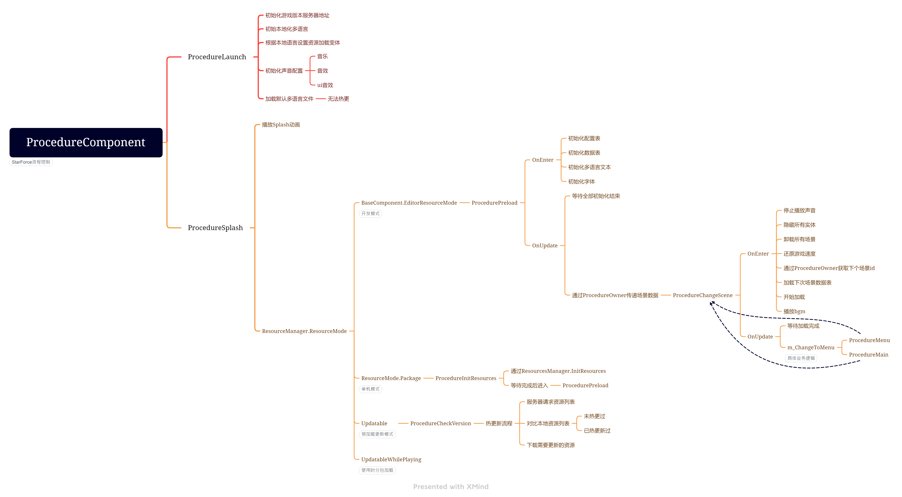
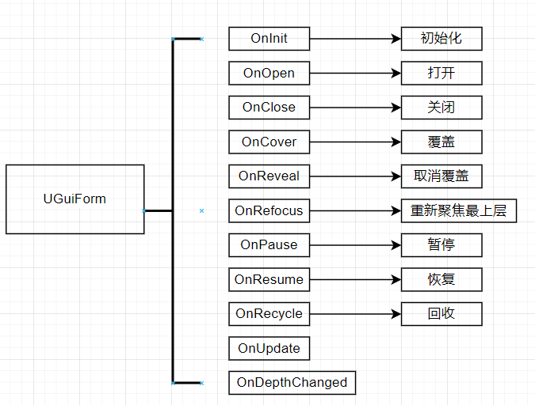

# GF模块简介
Game Framework 是一个基于 Unity 引擎的游戏框架，主要对游戏开发过程中常用模块进行了封装，很大程度地规范开发过程、加快开发速度并保证产品质量。

在最新的 Game Framework 版本中，包含以下 19 个内置模块，后续我们还将开发更多的扩展模块供开发者使用。

**全局配置 (Config)** - 存储一些全局的只读的游戏配置，如玩家初始速度、游戏初始音量等。

**数据结点 (Data Node)** - 将任意类型的数据以树状结构的形式进行保存，用于管理游戏运行时的各种数据。

**数据表 (Data Table)** - 可以将游戏数据以表格（如 Microsoft Excel）的形式进行配置后，使用此模块使用这些数据表。数据表的格式是可以自定义的。

**调试器 (Debugger)** - 当游戏在 Unity 编辑器中运行或者以 Development 方式发布运行时，将出现调试器窗口，便于查看运行时日志、调试信息等。用户还可以方便地将自己的功能注册到调试器窗口上并使用。

**下载 (Download)** - 提供下载文件的功能，支持断点续传，并可指定允许几个下载器进行同时下载。更新资源时会主动调用此模块。

**实体 (Entity) **- 我们将游戏场景中，动态创建的一切物体定义为实体。此模块提供管理实体和实体组的功能，如显示隐藏实体、挂接实体（如挂接武器、坐骑，或者抓起另一个实体）等。实体使用结束后可以不立刻销毁，从而等待下一次重新使用。

**事件 (Event)** - 游戏逻辑监听、抛出事件的机制。Game Framework 中的很多模块在完成操作后都会抛出内置事件，监听这些事件将大大解除游戏逻辑之间的耦合。用户也可以定义自己的游戏逻辑事件。

**文件系统 (File System)** - 虚拟文件系统使用类似磁盘的概念对零散文件进行集中管理，优化资源加载时产生的内存分配，甚至可以对资源进行局部片段加载，这些都将极大提升资源加载时的性能。

**有限状态机 (FSM)** - 提供创建、使用和销毁有限状态机的功能，一些适用于有限状态机机制的游戏逻辑，使用此模块将是一个不错的选择。

**本地化 (Localization)** - 提供本地化功能，也就是我们平时所说的多语言。Game Framework 在本地化方面，不但支持文本的本地化，还支持任意资源的本地化，比如游戏中释放烟花特效也可以做出几个多国语言的版本，使得中文版里是“新年好”字样的特效，而英文版里是“Happy New Year”字样的特效。

**网络 (Network)** - 提供使用 Socket 长连接的功能，当前我们支持 TCP 协议，同时兼容 IPv4 和 IPv6 两个版本。用户可以同时建立多个连接与多个服务器同时进行通信，比如除了连接常规的游戏服务器，还可以连接语音聊天服务器。如果想接入 ProtoBuf 之类的协议库，只要派生自 Packet 类并实现自己的消息包类即可使用。

**对象池 (Object Pool)** - 提供对象缓存池的功能，避免频繁地创建和销毁各种游戏对象，提高游戏性能。除了 Game Framework 自身使用了对象池，用户还可以很方便地创建和管理自己的对象池。

**流程 (Procedure)** - 是贯穿游戏运行时整个生命周期的有限状态机。通过流程，将不同的游戏状态进行解耦将是一个非常好的习惯。对于网络游戏，你可能需要如检查资源流程、更新资源流程、检查服务器列表流程、选择服务器流程、登录服务器流程、创建角色流程等流程，而对于单机游戏，你可能需要在游戏选择菜单流程和游戏实际玩法流程之间做切换。如果想增加流程，只要派生自 ProcedureBase 类并实现自己的流程类即可使用。

**资源 (Resource) **- 为了保证玩家的体验，我们不推荐再使用同步的方式加载资源，由于 Game Framework 自身使用了一套完整的异步加载资源体系，因此只提供了异步加载资源的接口。不论简单的数据表、本地化字典，还是复杂的实体、场景、界面，我们都将使用异步加载。同时，Game Framework 提供了默认的内存管理策略（当然，你也可以定义自己的内存管理策略）。多数情况下，在使用 GameObject 的过程中，你甚至可以不需要自行进行 Instantiate 或者是 Destroy 操作。

**场景 (Scene)** - 提供场景管理的功能，可以同时加载多个场景，也可以随时卸载任何一个场景，从而很容易地实现场景的分部加载。

**配置 (Setting) **- 以键值对的形式存储玩家数据，对 UnityEngine.PlayerPrefs 进行封装，也可以将这些数据直接存储在磁盘上。

**声音 (Sound)** - 提供管理声音和声音组的功能，用户可以自定义一个声音的音量、是 2D 声音还是 3D 声音，甚至是直接绑定到某个实体上跟随实体移动。

**界面 (UI)** - 提供管理界面和界面组的功能，如显示隐藏界面、激活界面、改变界面层级等。不论是 Unity 内置的 uGUI 还是其它类型的 UI 插件（如 NGUI），只要派生自 UIFormLogic 类并实现自己的界面类即可使用。界面使用结束后可以不立刻销毁，从而等待下一次重新使用。

**Web 请求 (Web Request)** - 提供使用短连接的功能，可以用 Get 或者 Post 方法向服务器发送请求并获取响应数据，可指定允许几个 Web 请求器进行同时请求。

## DataTable
**数据表 (Data Table)** - 可以将游戏数据以表格（如 Microsoft Excel）的形式进行配置后，使用此模块使用这些数据表。数据表的格式是可以自定义的。
会根据<u>**GameMain/DataTables**</u>目录下的文件解析生成对应的DataRowBase的子类文件存放在<u>**GameMain/Scripts/DataTable**</u>目录下

## Procedure

## UI
GF的UI分为UIGroup和UIForm；

UIGroup中包含多个UIForm，由UIGroup管理其中的UIForm；

UIForm的层级等于所属UIGroup层级自身层级（SortOrder）；

UIGroup概念有点想UI中的默认层，Pop层，前景层，背景层，可自定义；

在场景UI节点添加UIGroup；

所有UI脚本必须继UGuiForm，UGuiForm继承UIFormLogic，UGuiForm中对所有Text做了本地化处理；
UI生命周期

UI的层级问题：

每个UIGroup要求设置order层级；

每个UIForm的层级最终是自身sortorder+所属group的order；

在创建预制体时可设置好；

## Entity
Entity个人理解相当于自己封装了一个MonoBehaviour类，但是还集成了Mono；

同时有GF的生命周期+Mono的生命周期；

Enity包括了GameObject的功能，由GF的EntityModule来控制Active；

Entity也是基于对象池的，从框架层管理内存问题；

使用
逻辑控制类继承EntityLogic，重写其中生命周期的方法（别忘记base.）；

显示某个Entity调用GameEntry.Entity.ShowEntity(id,path,group);

id在datatable中配置；

path为datatable中配置的默认路径+AssetName；（ResourceEditor界面的path）

Entity中提供了Attach方法；

通过GameEntry.Entity.AttachEntity()调用，此时会调用父物体EntityLogic中OnAttached周期，和子物体OnAttachTo周期；

解绑时调用OnDetached，OnDetachFrom；

Entity和EntityLogic
预制体不需要绑EntityLogic脚本，ShowEntity时会自动绑上EntityLogic+Entiy脚本；

这俩脚本相互引用，Entity的周期中都在调用EntiyLogic对应的周期函数；

Entity继承自IEntity，被EntityComponent管理；

小声比比：所以，这两个有一个就行，或者Entity其实不用继承Mono；

具体操作时，只写EntityLogic脚本，不用管Entity；